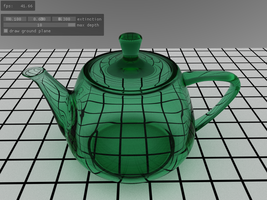
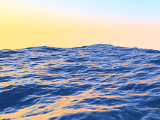
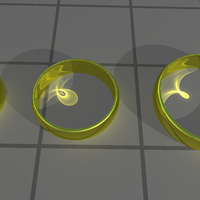
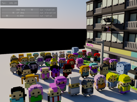

OptiX Advanced Samples
======================

This is a set of advanced samples for the [NVIDIA OptiX Ray Tracing Engine](https://developer.nvidia.com/optix).
They assume some previous experience with OptiX and physically based rendering, unlike the basic
tutorial-style samples in the SDK directory of the OptiX 4.0 distribution.
They also use some different libraries than the SDK samples; GLFW and imgui in
place of GLUT, for example.  This means you cannot generally copy one of the
advanced samples directly into the SDK, and vice versa.

Some samples, like [optixVox](./src/optixVox) and [optixParticleVolumes](./src/optixParticleVolumes), are new.  Others used to ship in some form with OptiX prior to version 4.

For requirements and build instructions see [INSTALL-LINUX.txt](./INSTALL-LINUX.txt) or [INSTALL-WIN.txt](./INSTALL-WIN.txt).

Technical support is available on [NVIDIA's Developer Zone](https://devtalk.nvidia.com/default/board/90/), or 
you can create a git issue.

