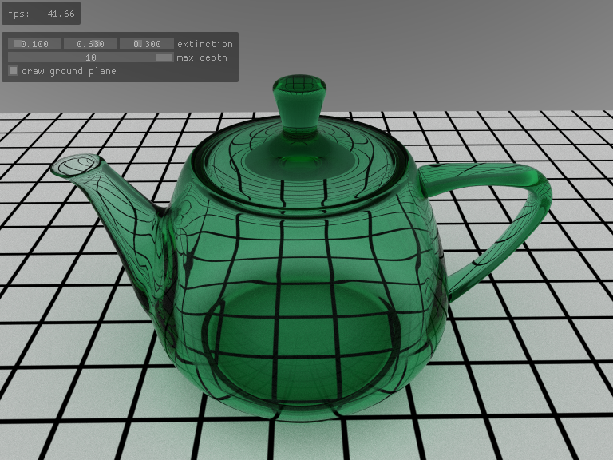
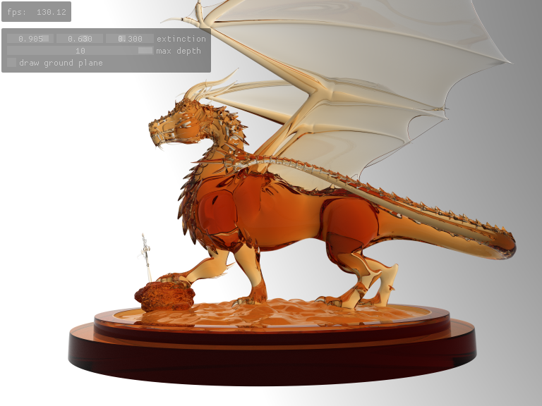

optixGlass
==========

A physically based glass shader example, using path tracing.  Drag the sliders around to change the color of the glass.
The teapot scene is loaded by default, but you can give one or more .obj or .ply files on the command line to load them instead.
Nested meshes, and meshes with a single layer, are not handled correctly right now but may still look interesting.

Models are from [Benedikt Bitterli's Rendering Resources](https://benedikt-bitterli.me/resources).

