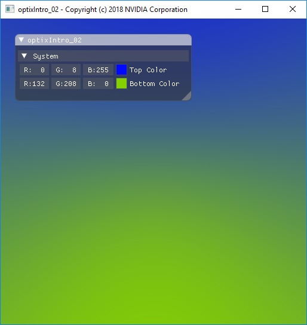
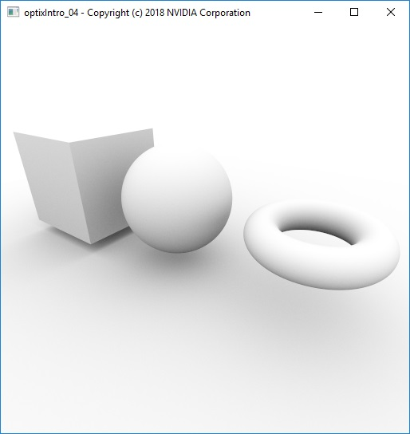
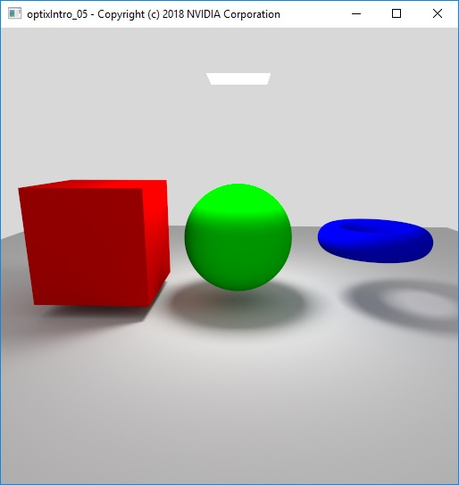
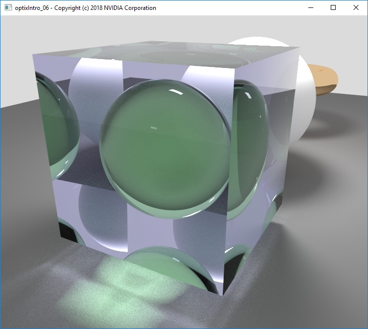
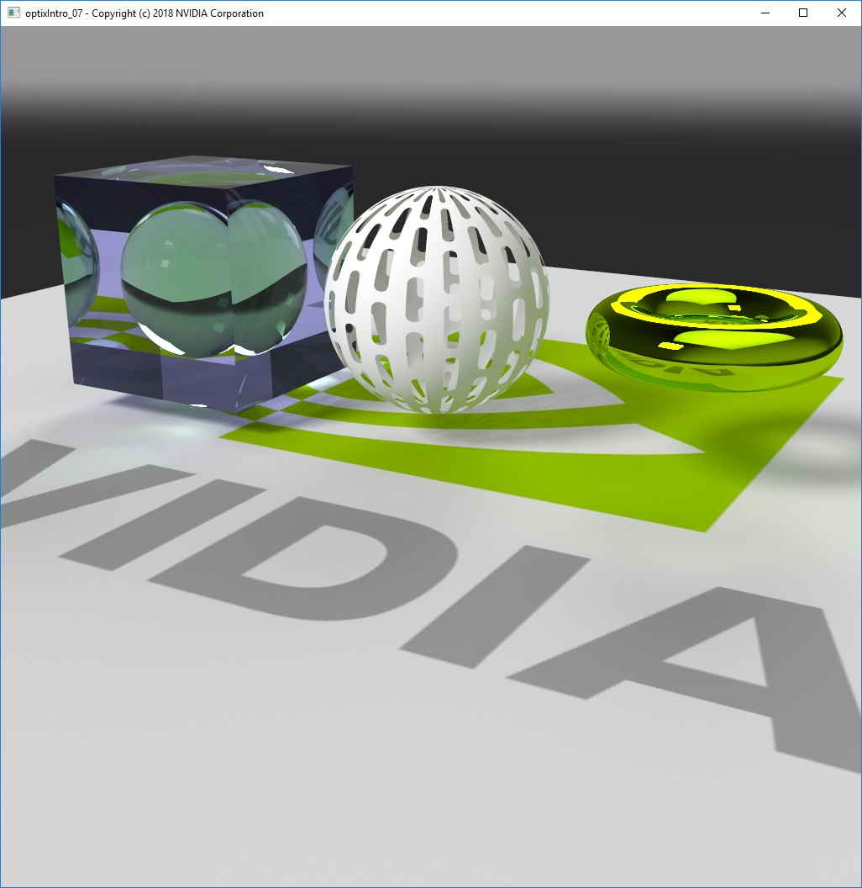
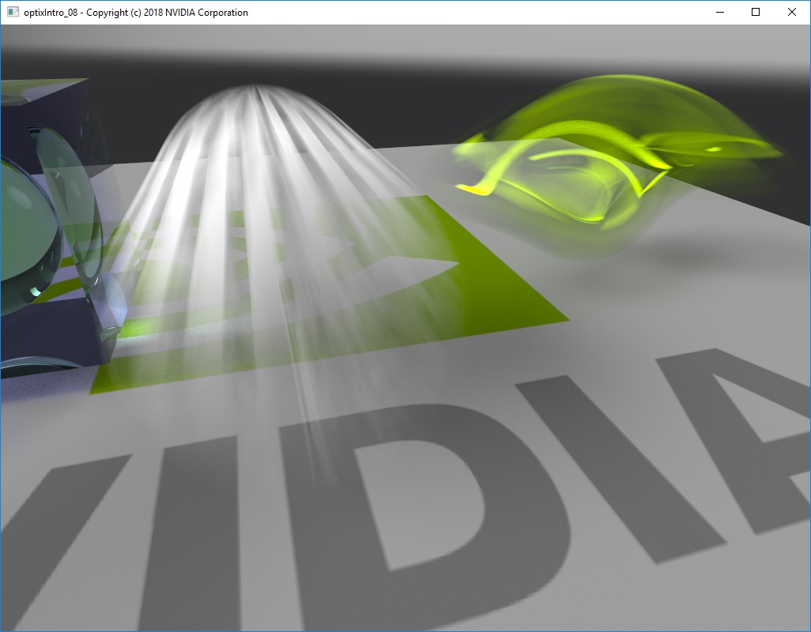
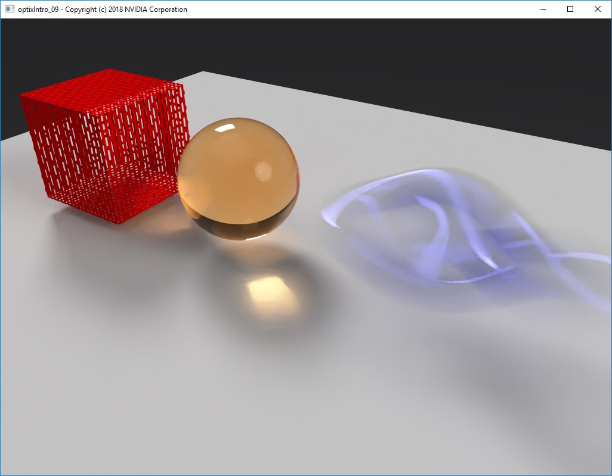
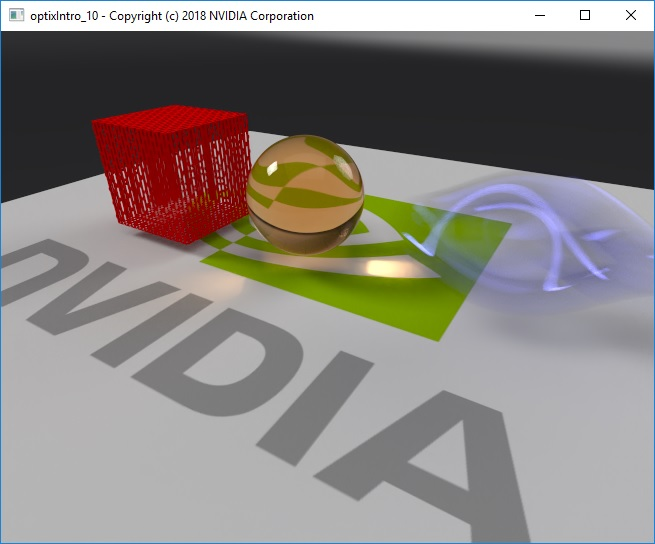
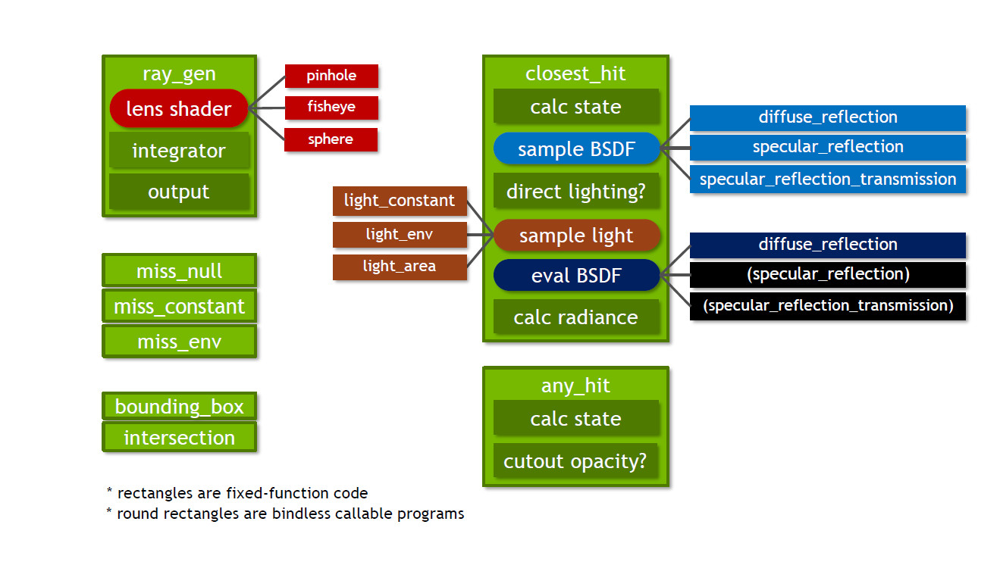

OptiX Introduction Samples
==========================
This is a set of introductory samples for the [NVIDIA OptiX Ray Tracing Engine](https://developer.nvidia.com/optix) which have been developed to accompany the GTC 2018 presentation S8518 "An Introduction to NVIDIA OptiX". The slides and recording of that presentation can be found at [GTC On Demand](http://on-demand-gtc.gputechconf.com/gtcnew/on-demand-gtc.php) publicly about a month after the GTC 2018.

The examples are similar to the existing OptiX Tutorial examples inside the OptiX SDK, but this time with a progressive uni-directional path tracer as foundation to be able to show motion blur and the deep learning denoiser features of the OptiX 5.x version.

They also use some different libraries than the SDK samples, GLFW and ImGui in place of GLUT, for example.
This means you cannot generally copy one of the advanced samples directly into the SDK, and vice versa.

The optixIntro_07 sample adds texture image loading via the [DevIL](http://openil.sourceforge.net/) image library.
This adds DevIL as an additional dependency to the OptiX Advanced Samples.

For requirements and build instructions see [INSTALL-LINUX.txt](../../INSTALL-LINUX.txt) or [INSTALL-WIN.txt](../../INSTALL-WIN.txt) inside the OptiX Advanced Samples root directory.

Technical support is available on [NVIDIA's Developer Forum](https://devtalk.nvidia.com/default/board/254/optix/), or you can create a git issue.

**User Interaction inside the examples**:

* Left Mouse Button + Drag = Orbit (around center of interest)
* Middle Mouse Button + Drag = Pan
* Right Mouse Button + Drag = Dolly (nearest distance limited to center of interest)
* Mouse Wheel = Zoom (1 - 179 degrees field of view possible)
* SPACE  = Toggle GUI display on/off

Following is a description of what the individual examples implement. 

**optixIntro_01 shows how to**:
* use CMake to generate projects among different platforms and compilers.
* setup an OptiX application framework based on GLFW, GLEW, OpenGL, ImGui.
* initialize the minimum OptiX objects to write to a buffer from within a ray generation program.
* dump information about the GPU devices visible to OptiX.
* declare variables and buffers on host and device side.
* use a host buffer or an OpenGL interoperability buffer to display an image rendered in OptiX.
* change variable values and buffer sizes, and read buffer contents on the host.
* setup a ray generation program which fills the output buffer without shooting any rays, basically a 2D compute kernel.
* setup a exception program to catch errors thrown by OptiX on device side.
* declare and use variables with the predefined OptiX semantics rtLaunchIndex.
* setup an empty scene graph root Group node with NoAccel Acceleration.

**optixIntro_02 shows additionally how to**:
* implement a pinhole camera view frustum to generate primary rays in the ray generation program.
* implement mouse interaction to manipulate the pinhole camera (orbit, pan, dolly, zoom).
* setup a developer defined per ray payload.
* use rtTrace to combine rays with per ray payload and start traversal at the scene root node (empty Group in this demo).
* implement a miss program which returns data inside the per ray payload.
* declare and use variables with the predefined OptiX semantics rtLaunchIndex, rtLaunchDim, rtCurrentRay, rtPayload.

**optixIntro_03 shows additionally how to**:
* build a plane and sphere geometry from an indexed triangle mesh.
* create a Geometry node with buffers holding the vertex attributes and index attributes.
* implement a bounding box and intersection program for indexed triangles.
* combine attribute and index buffers and bounding box and intersection programs to build a Geometry node.
* calculate vertex attributes inside the intersection program and access them inside another program domain.
* implement a closest hit program which visualizes the current shading normal in world space coordinates.
* create a Material which holds a closest hit program.
* create a GeometryInstance node, which combines a Geometry with a Material.
* create GeometryGroups which combine GeometryInstances with an Acceleration structure.
* setting Acceleration properties to invoke a specialized fast builder for triangle primitives.
* create Transform nodes which place GeometryGroups into the world coordinate system.
* put everything under the scene's root Group which holds the top level Acceleration structure.
* implement a white environment miss program.
* use a Timer class to measure scene setup time

**optixIntro_04 shows additionally how to**:
* build a box and torus geometry from an indexed triangle mesh.
* implement a fast iterative brute force path tracer (no direct lighting).
* implement a progressive renderer, accumulating values in an input_output buffer.
* automatic antialiasing of the rendered image by sub-pixel jittering inside the ray generation program.
* separating the integrator into an inlined function.
* implement a diffuse reflection shading (Lambert) inside a closest hit program.
* connect all material parameters in a buffer with individual scene objects.
* use the variable scoping in OptiX to minimize the number of Material nodes needed.
* use the maximum path length limit to automatically generate ambient occlusion results.
* implement a tonemapper post-process as GLSL shader working on HDR data.
* use the Timer class to schedule image updates only once per second to improve performance (reduced PCI-E bandwidth).
* drive renderer system and tonemapper settings and material parameters from the GUI.
* visualize incorrect results in the output (negative, infinite, and not-a-number) for debugging.

**optixIntro_05 shows additionally how to**:
* implement direct lighting in an iterative path tracer.
* switch between brute force path tracing and next event estimation with the compile time switch USE_NEXT_EVENT_ESTIMATION.
* implement a black environment (not a light).
* implement a white spherical environment light.
* implement a parallelogram area light with diffuse emission distribution function.
* create different light setups in the scene.
* implement direct lighting with multiple importance sampling between BSDF and light EDF.
* implement another ray type for visibility checks only (shadow rays).
* implement an anyhit program for the shadow ray type.
* use buffers of bindless callable program IDs (effectively a function table in OptiX) to access two different light sampling functions.
* setup a user defined light definition with an arbitrary number of lights.
* sample one of many lights per diffuse hit event and show how to compensate for the probabilities to have picked one light.

**optixIntro_06 shows additionally how to**:
* use a single closest hit program for all materials.
* implement BSDF sampling and evaluation functions as bindless callable programs to reduce the OptiX kernel size.
* implement BSDFs for diffuse reflection (Lambert), specular reflection (tinted mirror) and specular reflection transmission (glass).
* implement thin-walled materials.
* select dynamically which BSDF to use via the material parameters.
* support nested materials with proper index of refraction handling between media and proper absorption calculation in the integrator.
* implement different camera projections with bindless callable programs for pinhole, fisheye and sphere projections.
* switch between the camera projections instantly at runtime.

**optixIntro_07 shows additionally how to**:
* load images of different formats with DevIL (image library) into a data structure on the host (Picture class holding Images).
* convert many texture formats from the loaded format to one supported by CUDA (only 1, 2, and 4 components).
* create an OptiX TextureSampler and its associated Buffer which define the type (1D, 2D, 3D, cubemap without or with mipmaps; no layered textures handled in this demo).
* implement an importance sampled HDR spherical environment light.
* generate the necessary data (CDFs and integral) to do importance sampling of the environment. (Details can be found inside the "Physically Based Rendering" book.)
* use bindless texture and buffer IDs to access the HDR environment data via the LightDefinition structure on device side.
* add a bindless callable program light sampling function for the spherical HDR environment light.
* use bindless texture IDs to pass TextureSamplers to the OptiX device code and enable runtime decision if a texture is present.
* add a GUI control if any of the materials should use the texture or not.
* implement texture driven cutout opacity in anyhit programs for the radiance and shadow ray types.
* add third material supporting cutout opacity.

**optixIntro_08 shows additionally how to**:
* implement linear translation and scale-rotation-translation motion blur via Transform nodes.
* use the rtTrace call with a time value and how to access the variable with semantic rtCurrentTime in other program domains.
* implement stochastic motion blur camera and different rolling shutter effects, switchable at runtime.

**optixIntro_09 shows additionally how to**:
* use the OptiX 5.0.1 Deep Learning Denoiser to reduce the random noise from the images. (All behind a compile time switch USE_DENOISER.)
* implement a custom tonemapper ray generation entry point running before the denoiser. (Same as the one from the GLSL shader, which then becomes a copy operation.)
* configure the post-processing CommandList running the custom tonemapper and built-in DL Denoiser.
* setup the additionally required buffers for the post-processing.
* generate albedo values in the renderer to improve the denoising quality. (Different options prepared inside the code for specular materials.)
* use RT_BUFFER_GPU_LOCAL to speed up the accumulation in the output buffer on multi-GPU setups in the denoiser case.
* interactively blend the original and denoised result with a GUI value.

**optixIntro_10 shows additionally how to**:
* use the new OptiX 5.1.0 HDR DL Denoiser to reduce random noise from images.
* use the USE_DENOISER compile time defines to conditionally configure the denoiser to use 
* - the beauty buffer only,
* - the beauty buffer and the albedo buffer (default configuration),
* - the beauty buffer, the albedo buffer, and the normal buffer (ignored!).
* generate normal buffer data for the denoiser in camera space. (Note that the normal buffer is ignored by OptiX 5.1.0! This code is just for demonstration purposes.)
* limit the amount of memory the DL Denoiser uses internally. (Currently commented out.)
* set the OptiX usage report callback to output information about errors, warnings, and statistics.
* This example effectively supersedes the optixIntro_09 example when using OptiX 5.1.0 (at this time) because the HDR denoiser allows to keep the results full HDR throughout the rendering pipeline before final tone-mapping, which again is a post-process done by the rasterizer in a GLSL shader while displaying the final result.

A block diagram of the resulting renderer implementation provided in the later examples of this OptiX introduction tutorial looks like this:

