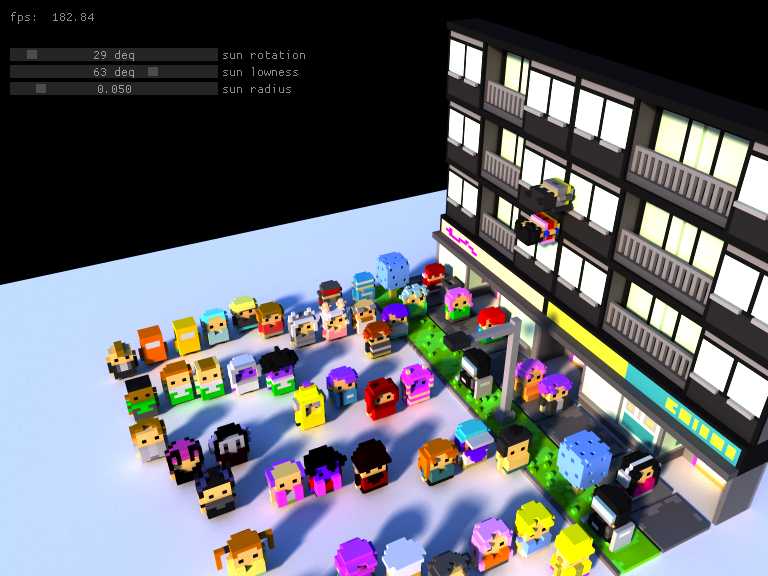

optixVox
========

A sample that renders a subset of the [MagicaVoxel @ ephtracy](https://ephtracy.github.io/) 8-bit VOX file format, using path tracing.
This is not volume rendering; "voxels" are solid boxes.  Give multiple .vox files on the command line to load them all and arrange them in
a grid.

The default scene shown here is part of the [Mini Mike's Metro Minis](https://github.com/mikelovesrobots/mmmm) collection created by Mike Judge.
You can also make your own scenes with MagicaVoxel.

Limitations:
The sample respects the VOX palette but ignores any material parameters right now and just makes everything diffuse.  Some features in the 
MagicaVoxel viewer, e.g., depth of field and extra light types, are also omitted for now, but could be added if there's interest.

